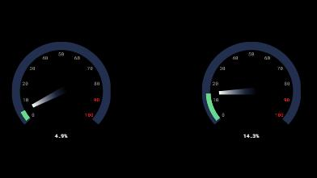
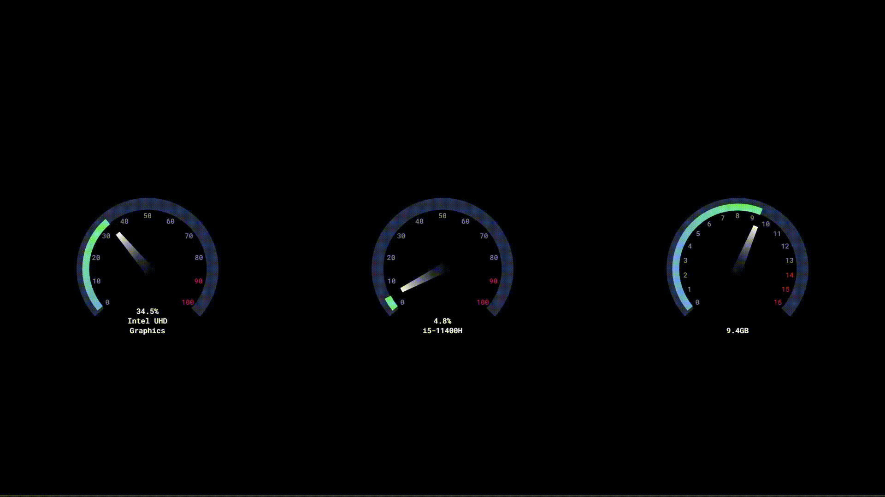

<h2>System-Dials</h2>

  

usage
## Contents
- [About](#about)
- [Features](#features)
- [Download](#download)
- [Support](#support)

## About

An animated wallpaper made using lively hardware API showing system usage info on dials. [Learn more..](https://github.com/rocksdanister/lively/wiki/API)

## Features

* Customisible Color.
* Automatic query of system stats.

## Download
##### [Get Lively](https://github.com/rocksdanister/lively/releases)
##### [Get System Dials](https://github.com/NatromeTex/System-Dials/releases)

## Install Instructions

Download the latest release, extract the archive and place the files in your lively wallpaper folder.

## Support

* GPU and CPU names are being extracted from larger names. If your CPU or GPU shows up as "Unkown", please open an issue and include your CPU/GPU name as it shows in your system.

* More dial types and frames to be added in the future

* 30fps lock in the settings does NOT work and will be fixed

